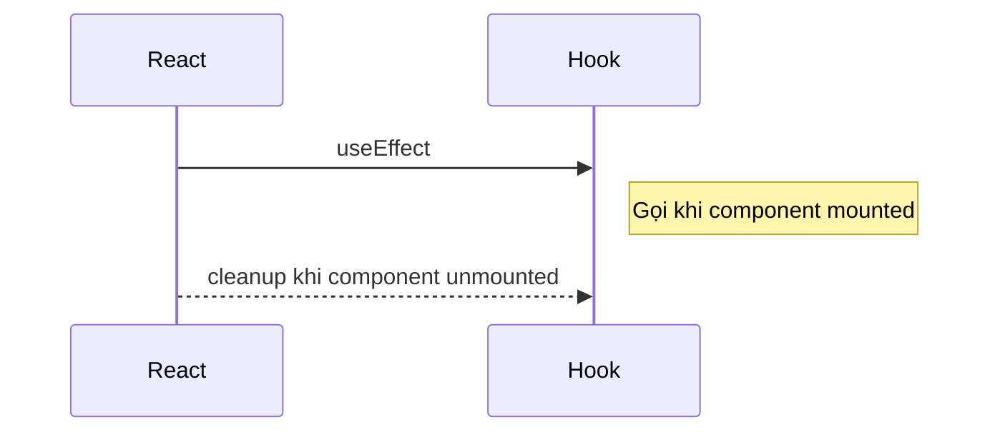
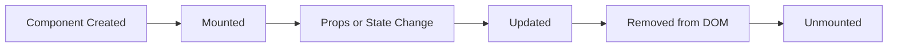
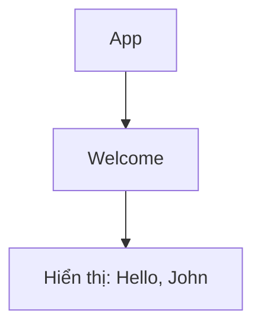
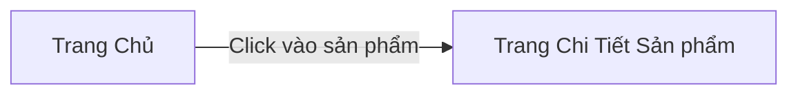
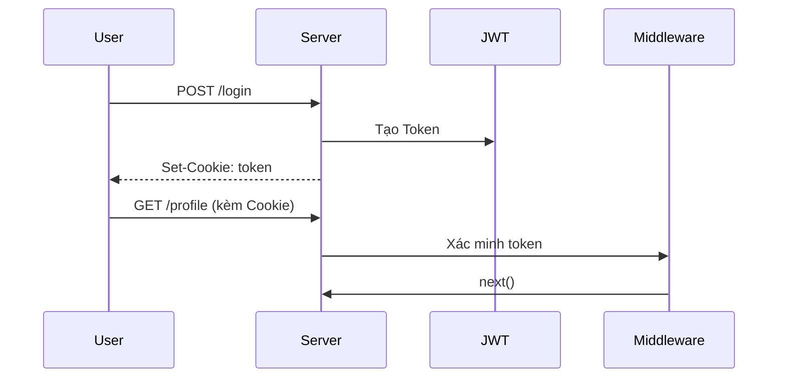
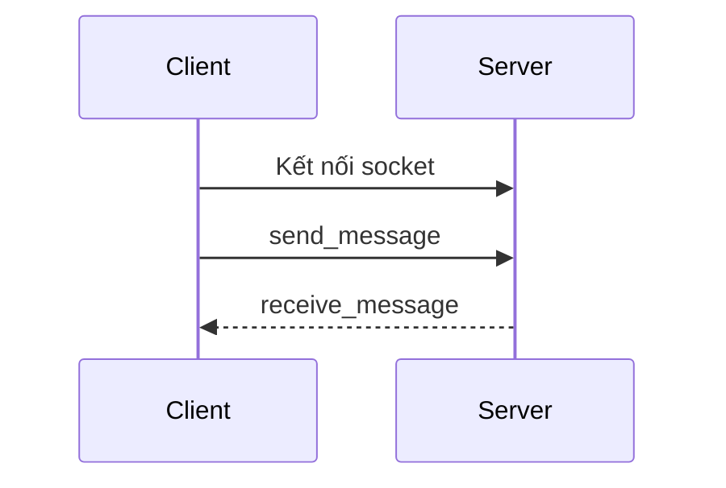
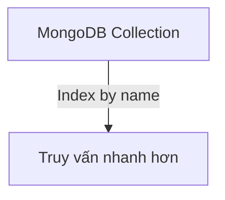

# 📘 Web Development Handbook for Interviews

Tài liệu tổng hợp các kiến thức quan trọng về phát triển web với các framework phổ biến như **React**, **Express**, **MongoDB**, và các kỹ thuật thường gặp trong phỏng vấn. Nội dung được trình bày dễ hiểu, có ví dụ thực tế và sơ đồ minh họa để người học dễ hình dung.

---

## 📌 I. Kiến Thức Cơ Bản

(Đã đầy đủ)

---

## ⚛️ II. ReactJS (Front-End)

### 1. Hooks là gì?

Hooks là các hàm đặc biệt giúp bạn dùng state, effect, ref,... trong function component.

#### Một số hooks quan trọng:

* `useState`: Khởi tạo và thay đổi state
* `useEffect`: Xử lý side effect (fetch API, timer,...)
* `useRef`: Truy cập DOM hoặc lưu giá trị không bị render lại
* `useMemo`, `useCallback`: Tối ưu performance
* `useReducer`: Thay thế useState trong logic phức tạp

**Ví dụ - useEffect:**

```js
useEffect(() => {
  console.log("Component Mounted")
  return () => console.log("Component Unmounted")
}, [])
```



### 2. Lifecycle trong function component

Lifecycle mô tả các giai đoạn hoạt động của component:

* **Mount**: Khi component được tạo lần đầu
* **Update**: Khi props hoặc state thay đổi
* **Unmount**: Khi component bị xoá khỏi giao diện

**Ví dụ:**

```js
useEffect(() => {
  console.log('Component mounted')
  return () => console.log('Component unmounted')
}, [])
```



### 3. Component là gì?

Component là khối giao diện độc lập, có thể tái sử dụng. Chúng có thể nhận dữ liệu qua props và quản lý trạng thái nội bộ.

**Ví dụ: Component chào người dùng**

```jsx
function Welcome({ name }) {
  return <h1>Hello, {name}</h1>;
}
```



### 4. React Router

React Router dùng để chuyển trang trong ứng dụng một cách mượt mà (không reload toàn trang).

**Ví dụ:**

```jsx
<Route path="/product/:id" element={<ProductPage />} />
```

* `useParams()`: lấy `id` từ URL
* `useNavigate()`: chuyển hướng trang



### 5. State Management

#### a. `useState` và `useReducer`

* `useState`: dùng cho state đơn giản
* `useReducer`: dùng cho state phức tạp, nhiều hành động

**Ví dụ - useReducer:**

```js
function reducer(state, action) {
  switch (action.type) {
    case 'increment': return { count: state.count + 1 }
    default: return state;
  }
}
const [state, dispatch] = useReducer(reducer, { count: 0 });
```

#### b. Context API

Dùng để chia sẻ dữ liệu giữa các component mà không cần truyền props qua nhiều cấp.

```jsx
const ThemeContext = createContext();
function App() {
  return <ThemeContext.Provider value="dark"><Home /></ThemeContext.Provider>
}
```

#### c. Redux Toolkit

Redux Toolkit giúp cấu trúc và viết Redux dễ hơn:

```js
const counterSlice = createSlice({
  name: 'counter',
  initialState: 0,
  reducers: {
    increment: state => state + 1
  }
});
```

#### d. Zustand (state nhỏ, đơn giản)

```js
const useStore = create(set => ({
  count: 0,
  increment: () => set(state => ({ count: state.count + 1 }))
}));
```

### 6. Tối ưu hóa hiệu năng

#### a. `useMemo`

Tránh tính toán lại nếu không cần thiết

```js
const total = useMemo(() => a + b, [a, b]);
```

#### b. `useCallback`

Tránh tạo lại hàm nếu không cần

```js
const handleClick = useCallback(() => doSomething(), []);
```

#### c. React.memo

Ngăn re-render không cần thiết của component con

```js
const MyComponent = React.memo(({ value }) => <div>{value}</div>);
```

### 7. Custom Hook

Tạo hook dùng lại logic chung nhiều chỗ:

```js
function useDebounce(value, delay) {
  const [debounced, setDebounced] = useState(value);
  useEffect(() => {
    const handler = setTimeout(() => setDebounced(value), delay);
    return () => clearTimeout(handler);
  }, [value]);
  return debounced;
}
```

### 8. UI nâng cao

* **Pagination**: chia danh sách thành nhiều trang
* **Searching, Filtering**: tìm kiếm/lọc dữ liệu
* **Debounce**: chờ người dùng ngừng nhập mới gửi request
* **Error Boundary**: bắt lỗi không làm crash toàn bộ app
* **Lazy loading**: tải component khi cần (React.lazy)

---
# 📘 Web Development Handbook for Interviews

Tài liệu tổng hợp các kiến thức quan trọng về phát triển web với các framework phổ biến như **React**, **Express**, **MongoDB**, và các kỹ thuật thường gặp trong phỏng vấn. Nội dung được trình bày dễ hiểu, có ví dụ thực tế và sơ đồ minh họa để người học dễ hình dung.

---

## 🚀 III. ExpressJS & Authentication

### 1. ExpressJS cơ bản

```js
const express = require('express');
const app = express();
app.use(express.json());
app.get('/', (req, res) => res.send('Hello World'));
app.listen(3000);
```

**Các thành phần:**

* `routes/`: quản lý đường dẫn API
* `controllers/`: xử lý logic
* `middlewares/`: trung gian như auth, log

### 2. RESTful API với Express

```js
// Product route
router.get("/products", getAllProducts);
router.post("/products", createProduct);
```

### 3. Middleware cơ bản

```js
function logger(req, res, next) {
  console.log(`${req.method} ${req.url}`);
  next();
}
app.use(logger);
```

### 4. Authentication với JWT

```js
const token = jwt.sign({ userId }, process.env.SECRET);
res.cookie('token', token, { httpOnly: true });
```

```js
function verifyToken(req, res, next) {
  const token = req.cookies.token;
  try {
    const decoded = jwt.verify(token, process.env.SECRET);
    req.user = decoded;
    next();
  } catch (e) {
    res.status(401).json({ message: 'Unauthorized' });
  }
}
```



---

## 🧪 IV. Testing trong React & Node

### 1. Unit Test (Jest)

```js
test('add numbers', () => {
  expect(1 + 2).toBe(3);
});
```

### 2. React Testing Library

```jsx
render(<Counter />);
fireEvent.click(screen.getByText('+'));
expect(screen.getByText('1')).toBeInTheDocument();
```

### 3. Supertest cho API

```js
const request = require('supertest');
const app = require('../app');

test('GET /api/products', async () => {
  const res = await request(app).get('/api/products');
  expect(res.statusCode).toBe(200);
});
```

---

## ⚙️ V. CI/CD & Deployment

### 1. GitHub Actions (CI)

```yaml
name: CI Test
on: [push]
jobs:
  test:
    runs-on: ubuntu-latest
    steps:
      - uses: actions/checkout@v2
      - run: npm install
      - run: npm test
```

### 2. Docker hóa app

**Dockerfile cho Express:**

```Dockerfile
FROM node:18
WORKDIR /app
COPY . .
RUN npm install
CMD ["node", "index.js"]
```

### 3. Deploy với Vercel / Railway

* Frontend (React): dùng Vercel, Netlify
* Backend (Express): dùng Railway, Render

---


# 📘 Web Development Handbook for Interviews

Tài liệu tổng hợp các kiến thức quan trọng về phát triển web với các framework phổ biến như **React**, **Express**, **MongoDB**, và các kỹ thuật thường gặp trong phỏng vấn. Nội dung được trình bày dễ hiểu, có ví dụ thực tế và sơ đồ minh họa để người học dễ hình dung.

---

## 📌 I. Kiến Thức Cơ Bản

(Đã đầy đủ)

---

## ⚛️ II. ReactJS (Front-End)

(Đã đầy đủ)

---

## 🚀 III. ExpressJS & Authentication

(Đã đầy đủ)

---

## 🧪 IV. Testing trong React & Node

(Đã đầy đủ)

---

## ⚙️ V. CI/CD & Deployment

(Đã đầy đủ)

---

## 🔌 VI. Socket.IO Realtime Communication

Socket.IO là thư viện giúp tạo kết nối **realtime 2 chiều** giữa client và server.

### 1. Cài đặt

```bash
npm install socket.io socket.io-client
```

### 2. Server sử dụng Socket.IO

```js
const http = require('http');
const { Server } = require('socket.io');

const server = http.createServer(app);
const io = new Server(server, { cors: { origin: '*' } });

io.on('connection', (socket) => {
  console.log('User connected:', socket.id);

  socket.on('send_message', (msg) => {
    io.emit('receive_message', msg);
  });

  socket.on('disconnect', () => console.log('User disconnected'));
});
```

### 3. Client sử dụng Socket.IO

```js
import { io } from 'socket.io-client';
const socket = io('http://localhost:3000');

socket.emit('send_message', 'Hello!');
socket.on('receive_message', (msg) => console.log('Received:', msg));
```



---

## 🍃 VII. MongoDB Nâng Cao

### 1. Aggregate (Truy vấn nâng cao)

Aggregate cho phép xử lý dữ liệu phức tạp như filter, group, sort, join...

**Ví dụ: Đếm số đơn hàng theo khách hàng**

```js
Order.aggregate([
  { $group: { _id: '$userId', totalOrders: { $sum: 1 } } }
]);
```

**Pipeline cơ bản:**

* `$match`: lọc dữ liệu
* `$group`: gom nhóm và thống kê
* `$sort`: sắp xếp
* `$lookup`: join bảng khác

```js
Order.aggregate([
  { $match: { status: 'delivered' } },
  { $group: { _id: '$userId', total: { $sum: '$amount' } } },
  { $sort: { total: -1 } }
]);
```

### 2. Lookup (Join giữa collections)

```js
Order.aggregate([
  {
    $lookup: {
      from: 'users',
      localField: 'userId',
      foreignField: '_id',
      as: 'userInfo'
    }
  }
]);
```

### 3. Indexing

Index giúp truy vấn nhanh hơn (tương tự như mục lục).

**Tạo index:**

```js
Product.createIndex({ name: 1 });
```

* `1`: tăng dần, `-1`: giảm dần

**Tìm các index đang có:**

```js
Product.getIndexes();
```

**Tìm kiếm tối ưu:**

```js
Product.find({ name: 'iPhone' }).explain('executionStats');
```



---

## ✨ VIII. Tiếp theo?

Bạn có thể yêu cầu thêm các phần như:

* **Next.js** (CSR, SSR, ISR)
* **TypeScript trong React và Node**
* **GraphQL** và so sánh với REST
* **Realtime Notifications nâng cao**

Hãy bảo mình viết phần bạn cần tiếp theo nhé!

---

📚 Tổng hợp này giúp bạn nắm vững cả lý thuyết, thực hành và chuẩn bị phỏng vấn tốt hơn. Hãy luyện tập viết code và làm dự án nhỏ để hiểu sâu hơn!
